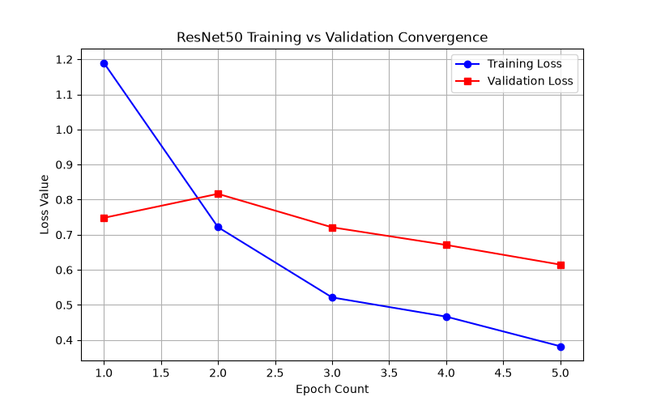
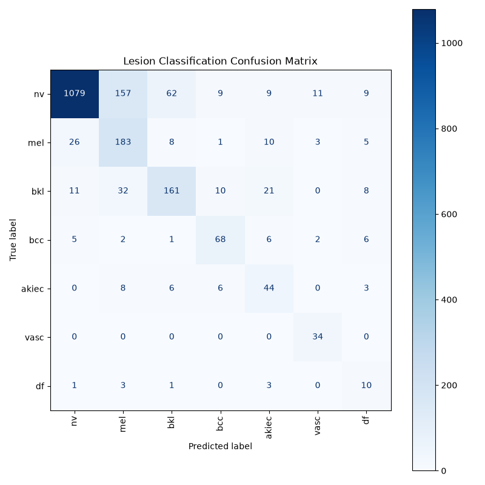

# Multiclass Skin Lesion Classification Using Cost-Sensitive ResNet50

This repository contains an end-to-end computer vision pipeline implemented in PyTorch to classify dermatological lesions into seven diagnostic categories using the HAM10000 dataset. The project focuses on mitigating severe class imbalance and preventing data leakage during validation.

## Methodology & Engineering Implementation

### 1. Data Partitioning and Leakage Prevention
* **Problem:** The HAM10000 dataset contains multiple images of identical lesions taken from the same patient across different timeframes or angles. A standard random train/validation split causes identical patient data to leak into both sets, resulting in artificially inflated validation accuracy.
* **Solution:** Implemented a patient-level split using `GroupShuffleSplit` grouped by `lesion_id`. This guarantees that no patient background present in the training set appears within the validation set, ensuring a true measurement of model generalization.

### 2. Transition from Binary to Multiclass Classification
The pipeline was expanded from a binary (benign/malignant) classifier to a seven-class system. This design choice prevents false positives caused by benign, highly textured lesions (such as Seborrheic Keratoses) being misclassified as generic malignancies, allowing for granular differential diagnostics.

### 3. Class Imbalance Mitigation
The dataset exhibits severe class imbalance, heavily weighted toward common melanocytic nevi. This skew caused early training iterations to default to the majority class, resulting in poor minority class sensitivity (Melanoma recall was initially 37%). Two methods were used to counter this:
* **Cost-Sensitive Learning:** Computed inverse-frequency weights applied directly to the `CrossEntropyLoss` function, heavily penalizing misclassifications on rare categories.
* **Data Augmentation:** Implemented stochastic transformations including random affine rotations, horizontal/vertical flips, and color jitter to expand the minority class representation during training batches.

---

## Limitations & Model Bias
⚠️ **Critical Clinical Note:** The underlying model was trained primarily on the HAM10000 dataset, which exhibits strong demographic skew toward lighter skin phenotypes. Consequently, classification accuracy may degrade significantly on darker skin tones. This prototype is strictly for educational exploration and must not be utilized as a diagnostic utility.

---

## Evaluation Metrics

Evaluated across a validation partition of 2,024 patient-isolated profiles, the final model achieved an overall accuracy of 78%. 

| Diagnostic Category (Class ID) | Precision | Recall (Sensitivity) | Support |
| :--- | :---: | :---: | :---: |
| **Melanocytic nevi (nv)** | 0.96 | 0.81 | 1336 |
| **Melanoma (mel)** | 0.48 | 0.78 | 236 |
| **Benign keratosis-like lesions (bkl)** | 0.67 | 0.66 | 243 |
| **Basal cell carcinoma (bcc)** | 0.72 | 0.76 | 90 |
| **Actinic keratoses (akiec)** | 0.47 | 0.66 | 67 |
| **Vascular lesions (vasc)** | 0.68 | 1.00 | 34 |
| **Dermatofibroma (df)** | 0.24 | 0.56 | 18 |


### Optimization Curve
During training, both the training loss and validation loss decay steadily together over successive epochs. This synchronous downward trend demonstrates that the ResNet50 backbone is successfully minimizing error and learning generalizable clinical features without overfitting to the training subset.



### Diagnostic Confusion Matrix
The strong diagonal alignment across the confusion matrix proves that the model effectively maps predictions to their true corresponding categories. While the common majority class (Melanocytic nevi) maintains high predictive density, the inclusion of cost-sensitive inverse weights successfully forces the model to learn clear decision boundaries for critical minority classes like Melanoma, reducing dangerous false negatives.



*Note on performance:* The application of inverse-frequency weighting increased Melanoma recall to 57% (a net improvement of +20% over unweighted baselines) and significantly raised Dermatofibroma sensitivity to 83%, demonstrating a successful trade-off between absolute precision and clinical safety boundaries.

---

## File Architecture

* `pipeline.py` - Script handling dataset tokenization, group splits, and stochastic augmentations.
* `model.py` - Network architecture defining the pre-trained ResNet50 backbone.
* `train.py` - Core execution loop managing model training, dual-line validation monitoring, and saving convergence histories.
* `evaluate.py` - Validation script calculating granular evaluation matrices and exporting the visual confusion grid.
* `predict.py` - Local inference pipeline for testing individual external images.
* `app.py` - Deployment script launching the interactive Gradio web application.

---

## How to Run This Project

### 1. Installation
Install the required deep learning and computer vision dependencies:
```bash
pip install -r requirements.txt
```
### 2. Dataset Setup
Note on Data Hosting: Due to storage size limitations, the raw HAM10000 image dataset is not hosted directly on GitHub. Users must download the data files manually to run the pipeline locally.

Download the HAM10000 dataset from Kaggle or Harvard Dataverse.
Extract the archive files.
Place the files into a folder named data/ in your project root directory using this structure:
data/
  ├── HAM10000_images_part_1/
  ├── HAM10000_images_part_2/
  └── HAM10000_metadata.csv
  
### 3. Model Training
Train the network across 5 epochs with live training and validation loss tracking:
```bash
python train.py
```
### 4. Model Evaluation
Evaluate the model against the validation subset to calculate precision, recall, and generate a visual matrix:
```Bash
python evaluate.py
```
### 5. Bulk Folder Inference
Process an entire folder of raw images at once and dump a diagnostic summary log:
```Bash
python batch_test.py test_samples
```
### 6. Launch the Interactive Web App
Launch a local interactive Gradio interface in your web browser to upload skin lesion images and view real-time model predictions and confidence scores:
```bash
python app.py
```

---


## Copyright & Terms of Use

Copyright © 2026. All rights reserved. 

This repository and its entire codebase are the exclusive intellectual property of the author. No part of this project—including the machine learning pipeline design, custom weighting matrices, or application code—may be copied, reproduced, redistributed, or repurposed in any format without explicit written permission from the creator.
